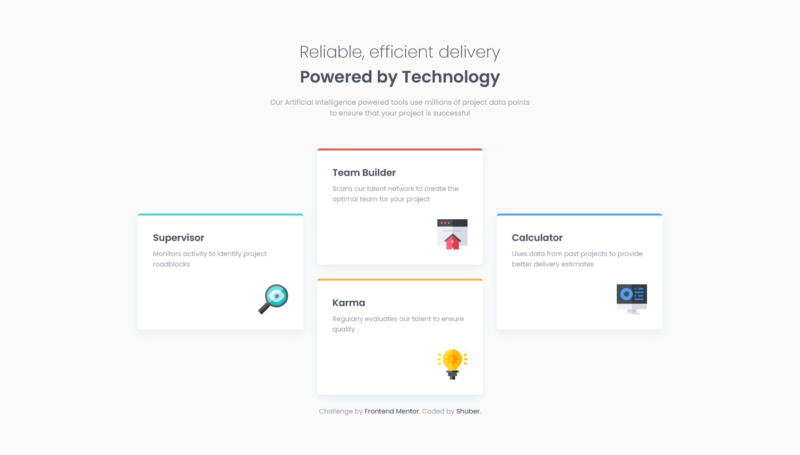
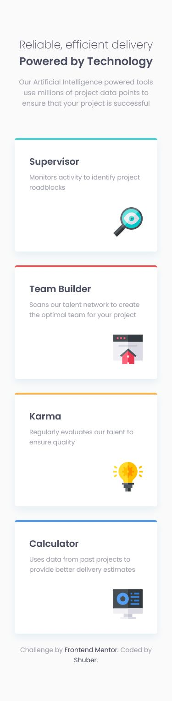

# Frontend Mentor - Four card feature section solution

This is a solution to the [Four card feature section challenge on Frontend Mentor](https://www.frontendmentor.io/challenges/four-card-feature-section-weK1eFYK). Frontend Mentor challenges help you improve your coding skills by building realistic projects.

## Table of contents

- [Overview](#overview)
  - [Screenshot](#screenshot)
  - [Links](#links)
- [My process](#my-process)
  - [Built with](#built-with)
  - [What I learned](#what-i-learned)
- [Author](#author)

## Overview

Hi! This is my attempt at the four card feature section.

My approach was to treat this section as its own "page", i.e. in terms of structuring divide it into a header, main and footer. I then worked on each section individually before fine-tuning everything to match the design images. As I'm on the free method, I used screenshots of my work in Photoshop to check if the font sizes and spacing matched the design.

### Screenshot

Desktop

Mobile

### Links

- Solution URL: [Here!](https://github.com/sheronimo/frontendmentor-fourcard)
- Live Site URL: [Here!](https://sheronimo.github.io/frontendmentor-fourcard/)

## My process

1. I worked on styling each individual component first, starting with the header before moving onto the cards.
2. For the cards, I completed the inner styling of the cards first before working on the grid positioning of the card items.
3. I then worked on the responsive layout.
4. Final tweaks to make sure it was as close to the design as possible.

### Built with

- Semantic HTML5 markup
- SASS
- Flexbox
- Grid

### What I learned

I primarily learned about how to specify positions for each individual item in a grid.

## Author

- Github - [sheronimo](https://github.com/sheronimo)
- Frontend Mentor - [@sheronimo](https://www.frontendmentor.io/profile/sheronimo)
